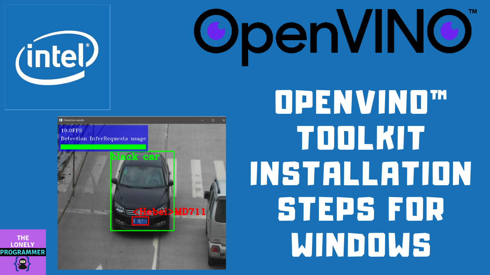
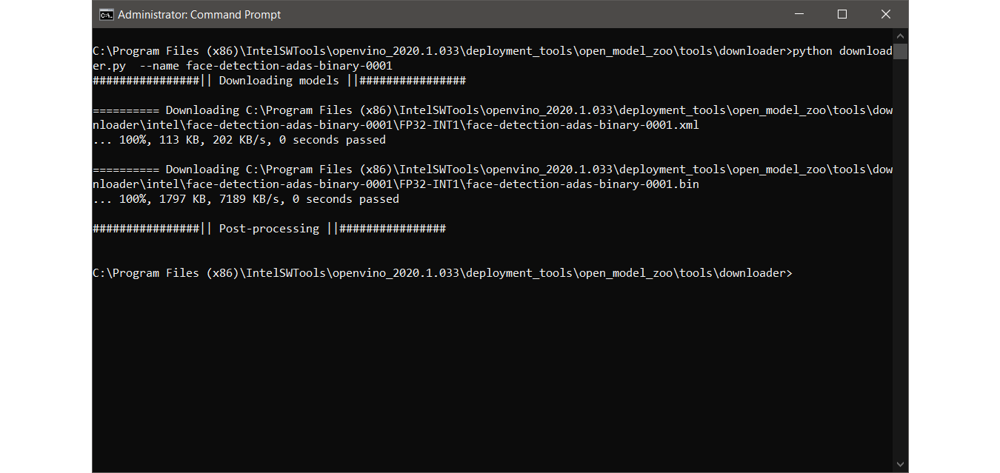
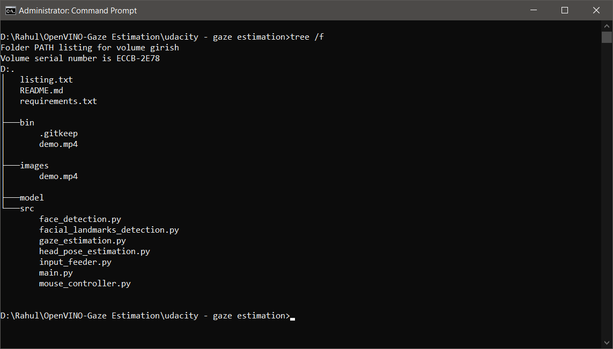
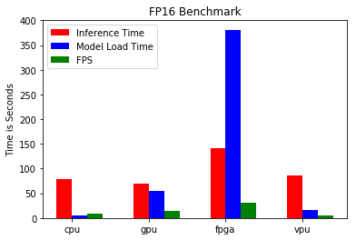
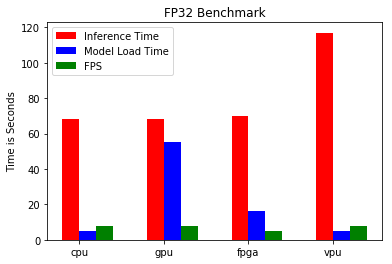
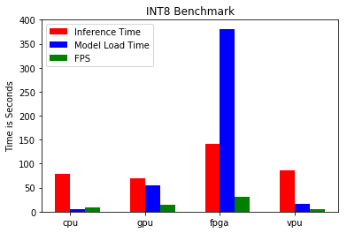

# Computer Pointer Controller

In this project, we will use a gaze detection model to control the mouse pointer of your computer. I'll be using the Gaze Estimation model to estimate the gaze of the user's eyes and change the mouse pointer position accordingly. This project will demonstrate the ability to run multiple models in the same machine and coordinate the flow of data between those models.

## Demo Video of the Project - Using Video as source  link

[](link "Working of the Project - Click to Watch!")

---

## Project Set Up and Installation

### Step 1: Ground work - Dependencies

- Firstly, we install the prerequisites from requirements.txt using the following command.

```
pip install -r requirements.txt
```

- Clone the repository

```
git clone https://github.com/Rahul24-06/Computer-pointer-Controller-using-Gaze-Estimation
```

- Initialize the OpenVINO environment 

```
cd <OppenVINO-Path>\IntelSWTools\openvino\bin\
setupvars.bat
```

### Step 2: Install Intel® Distribution of OpenVINO™ toolkit

Utilize the classroom workspace, or refer to the relevant instructions for your operating system for this step.

- [Linux/Ubuntu](./linux-setup.md)
- [Mac](./mac-setup.md)
- [Windows](./windows-setup.md)

I've made a step by step instruction walkthrough to install Intel® Distribution of OpenVINO™ toolkit on a Windows Machine.

[](https://youtu.be/fCo05FwH0oM "OpenVINO installation Video - Click to Watch!")

### Step 3: Downloading the pre-trained models

- Go to the *Model Downloader* directory: 

```
cd <OpenVINO-Path>\IntelSWTools\openvino\deployment_tools\tools\model_downloader
```

**1. Download Face Detection Model**

```
python downloader.py --name face-detection-adas-binary-0001
```

**2. Download Facial Landmarks Detection Model**

```
python downloader.py --name landmarks-regression-retail-0009
```

**3. Download Head Pose Estimation Model**

```
python downloader.py --name head-pose-estimation-adas-0001
```

**4. Download Gaze Estimation Model**

```
python downloader.py --name gaze-estimation-adas-0002
```



- Copy the downloaded models to the Project directory **<Project-Repo-Path>\model**. (Note that I've downloaded models wih FP32, FP16, & INT8 precision)

###  Project Directory Structure



This shows the directory structure of the project. The project directory contains the folders model, images, src which has the following files. 

* *images*: Contains all the image files used for the README.md.

* *model* : Contains the pre-trained model needed for the project. 
  * Face Detection model
  * Head Pose Estimation model
  * Facial Landmarks Detection model
  * Gaze Estimation model

* *src* : Contains the python script used in this project
  * face_detection.py - Contains Class with function to load the model, pre-process the input frame, perform inference to detect the face, and pre-process the output. 
  * facial_landmarks_detection.py - Contains Class with function to load the model, pre-process the faces from input frame, perform inference to detect the landmarks for eye, and pre-process the output.
  * head_pose_estimation.py -  Contains Class with function to load the model, pre-process the faces from input frame, perform inference to detect the head postion using the angles of yaw, pitch, and roll, and pre-process the output.
  * gaze_estimation.py - Contains Class with function to load the model, pre-process the left eye, right eye and the head pose angle from input frame, perform inference to predict the gaze vector, and pre-process the output.
  * input_feeder.py - Contains InputFeeder class to initialize VideoCapture with either 'CAM' or video_file and return the frames sequentially.
  * mouse_controller.py - Contains sample class that you can use to control the mouse pointer.
  * main.py - Integrates all the modules to run this project.
  
## Demo 

1. Initialize the OpenVINO environment 

```
cd <OppenVINO-Path>\IntelSWTools\openvino\bin\
setupvars.bat
```

2. Open a new terminal and run the following commands:

```
cd <Project-Repo-Path>\src
```
3. Run the main.py 

```
python main.py -f "Face Detection model  .xml file" -fl "Facial Landmark Detection model .xml file" -hp "Head Pose Estimation model .xml file" -g "Gaze Estimation model .xml file" -i "video file" or "CAM" -d "Target device"
```
"CPU" is the default Target device. Other devices such as "GPU", "MYRIAD", and "FPGA" is passsed based on the deployed device.

## Documentation

### How it Works

You will have to coordinate the flow of data from the input, and then amongst the different models and finally to the mouse controller. The flow of data will look like this:


Diagram showing the flow of data from the input, through the different models, to the mouse controller. 
While building the flow, you will need to make sure that you are aware of the input and output shapes of each model. If the shapes or data format are different for a particular model, you can account for this in the preprocessing methods (will go over this in more detail shortly).

### Pre-Trained Model Documentation

* [Face Detection Model](https://docs.openvinotoolkit.org/latest/_models_intel_face_detection_adas_binary_0001_description_face_detection_adas_binary_0001.html)
* [Facial Landmarks Detection Model](https://docs.openvinotoolkit.org/latest/_models_intel_landmarks_regression_retail_0009_description_landmarks_regression_retail_0009.html)
* [Head Pose Estimation Model](https://docs.openvinotoolkit.org/latest/_models_intel_head_pose_estimation_adas_0001_description_head_pose_estimation_adas_0001.html)
* [Gaze Estimation Model](https://docs.openvinotoolkit.org/latest/_models_intel_gaze_estimation_adas_0002_description_gaze_estimation_adas_0002.html)

### Command line arguments

The *main.py* file is fed with the following arguments in the command line inference, where 

* -f "Path to an .xml file with Face Detection model>"
* -fl "Path to an .xml file with Facial Landmark Detection model"
* -hp "Path to an .xml file with Head Pose Estimation model".
* -g "Path to an .xml file with Gaze Estimation model"
* -i "Path to image or video file or CAM"
* -d "Target device"

--------------------------------------------------------------------------------------------------------

## Benchmarks

The benchmark results of running your model on multiple hardwares and multiple model precisions. This include model loading time, input/output processing time, model inference time which are compared as follows: 

### FP16



### FP32



### INT8



## Results
*TODO:* Discuss the benchmark results and explain why you are getting the results you are getting. For instance, explain why there is difference in inference time for FP32, FP16 and INT8 models.

The Inference is done on four different devices. 
1. Intel Core i5-6500TE CPU
2. Intel Core i5-6500TE GPU
3. IEI Mustang F100-A10 FPGA 
4. Intel Neural Compute Stick 2 

From the benchmarking, the inference time, model load time and the frames per seconds (FPS) are given. 

* 

*  

* 

## Stand Out Suggestions

* The video feed can be either a video_file or directly from the Camera out. i.e Inference pipeline for both video file and webcam feed as allowed as input. It can be configured in the command line argument *-i "Video_file" or -i "CAM"* 

### Edge Cases

There will be certain situations that will break your inference flow. For instance, lighting changes or multiple people in the frame. Explain some of the edge cases you encountered in your project and how you solved them to make your project more robust.

*If you faced any issues in building this project, feel free to ask me. Please do suggest new projects that you want me to do next.*

*Share this video if you like.*

*Blog - https://rahulthelonelyprogrammer.blogspot.in/*

*Github - https://github.com/Rahul24-06*

*Instagram - https://www.instagram.com/the_lonely_programmer/*

*Happy to have you subscribed: https://www.youtube.com/c/rahulkhanna24june?sub_confirmation=1*

**Thanks for reading!**
